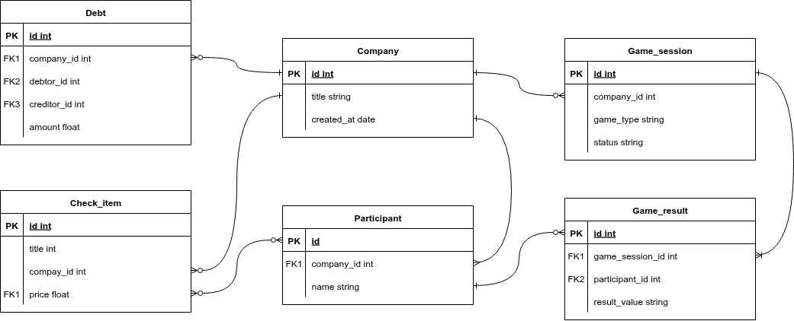

# Техническое задание: Веб-приложение "SplitShot"

## 1. Описание артефактов и терминов (Глоссарий)
- **Сплиттер** — модуль для разделения счета.
- **Компания (Вечеринка)** — сессия со списком участников.
- **Индекс трезвости** — число 0–100% по результатам теста.
- **Фант** — задание для участника (встроенное или кастомное действие/правда).

## 2. Продуктовое описание (Как продукт выглядит для пользователя)

### Идея
Веб-сайт, позволяющий упростить расчет чека в баре/ресторане для компании людей. Вводим свой чек, отмечаем, кто что пил/ел и скидываем деньги человеку, который оплатил счет. После решения финансовых вопросов приложение предлагает набор мини-игр для развлечения за столом.

### Сценарий использования
1. Открыть сайт и создать компанию (список имен).
2. **Сплиттер:** внести позиции чека и получить долги.
3. **Игры:**
   - «Колесо фортуны» — выбор, кто не платит.
   - «Тест на трезвость» — сетка 1–20 на время.
   - «Скороговорка» — запись голоса.

### Функциональные требования

#### Управление компанией
- Ввод имен (1–15 чел.), редактирование до игр.
- Сохранение в localStorage.

#### Сплиттер
- **Быстрый режим:** (общая сумма + чаевые) / кол-во людей.
- **Подробный режим:** добавление позиций (название, цена), привязка к участникам (чекбоксы), кнопка «Разделить на всех».
- **Формула распределения:**
  - Сумма каждого участника = сумма цен позиций, где он отмечен.
  - Если позиция отмечена у нескольких участников, ее цена делится поровну.
  - Чаевые распределяются пропорционально сумме каждого участника.
- **Механизм долгов:** итоговая сумма к оплате для каждого участника = его доля в чеке.
- **Итог:** список долгов по участникам, кнопка «Копировать долги в виде сообщения».

#### Игры

**Хаб игр:** сетка из карточек, каждая содержит название игры и иконку/превью. При клике — переход на страницу игры.

**Тест на трезвость:**
- Сетка 5×4 с числами 1–20 в случайном порядке.
- Нужно нажать числа по порядку (1, 2, … 20).
- Фиксируются ошибки и время.
- Считается индекс трезвости: `(базовое_время / время_игрока) - (ошибки × 0.05)`. Базовое время = 20 секунд.

**Скороговорка:**
- Показывается случайная скороговорка из списка.
- Кнопка «Записать», доступ к микрофону.
- **Варианты проверки:**
  - Через API распознавания речи (Yandex SpeechKit / Google Speech-to-Text).
  - «Режим караоке» — запись, затем голосование друзей.
- **Решение для MVP:** режим караоке с голосованием (API требует больше усилий).
- Результат: если проиграл — тянет фант.

**Колесо фортуны:**
- Подгружает имена из компании.
- Колесо с физикой вращения.
- Результат: «Сегодня не платит [Имя]» (или «Платит [Имя]»).

#### Расширяемость
- Модульная архитектура: каждая игра — отдельный компонент с роутом (`/game/название`).

## 3. Техническое описание (Архитектура решения)

### Стек технологий
- **Язык:** Python 3.10+
- **Backend-фреймворк:** FastAPI последней версии
- **Frontend:** HTML, CSS, JavaScript
- **Шаблонизатор:** Jinja2
- **БД:** PostgreSQL
- **Развертывание:** Docker
- **WebSockets:** для мультиплеера (будущие версии)

### Зачем нужен бэкенд
- Хранение статистики игр и рекордов (персональные)
- Хранение истории тусовок
- Хранение базы фантов и скороговорок
- Основа для мультиплеера в будущем

### Модели данных

### WebSockets (для будущих версий)
- **Что синхронизируется:** вращение колеса фортуны (у всех участников комнаты одинаковое отображение), голосование в скороговорке (счетчик голосов в реальном времени).
- **Как подключаются:** один участник создает компанию и получает код/ссылку, остальные вводят код и попадают в ту же компанию. WebSocket-соединение устанавливается по ID компании.

## 4. Условия эксплуатации
- **Разработка:** веб, mobile first
- **Браузеры:** последние 2 версии Chrome, Safari, Firefox (включая мобильные)
- **Тестовые устройства:** iPhone 12+ (iOS 15+), Samsung Galaxy S21+ (Android 11+)
- **Разрешения экрана:** от 375px до 428px (мобильные)

## 5. Правила выгрузки (Деплой и обновление)
- **Репозиторий:** GitHub
- **CI/CD:** автоматический деплой при пуше в ветку `main`
- **Среда выполнения:** Docker-контейнер
- **Хостинг:** (будет определен на этапе разработки)
- **Обновления:** новая версия автоматически разворачивается после пуша

## 6. Этапы разработки (Roadmap)

### Этап 1: MVP
- Создание компании (по ссылке)
- Быстрый сплиттер (сумма / кол-во + чаевые)
- Колесо фортуны (выбор из списка)
- Адаптив, темная тема

### Этап 2
- Подробный сплиттер (позиции, привязка к людям, WebSockets для синхронизации)
- Тест на трезвость (сетка 1–20)
- Скороговорка (караоке режим)

### Этап 3
- Скороговорка (интеграция с API)
- База фантов
- Новые игры («Правда или действие», «Я никогда не»)
- Статистика и рекорды по пользователю, история тусовок

## 7. История изменений
| Версия | Дата       | Автор           | Изменения |
|--------|------------|-----------------|-----------|
| 0.1    | 2026-02-25 | DaniilGGuY      | Стартовая версия ТЗ |
| 0.2    | 2026-03-20 | Pechenkai       | Добавлена модель данных |
| 0.3    | 2026-03-23 | Команда         | Добавлены: формула распределения чека, механизм долгов, обоснование бэкенда, описание WebSockets |
| 0.4    | 2026-03-26 | flamingorozovai | Добавлена таблица рисков проекта |
| 0.5    | 2026-03-28 | Pechenkai       | Добавлена PERT-диаграмма |
| 0.6    | 2026-03-29 | Pechenkai       | Добавлено wiki к проекту |
| 0.7    | 2026-04-06 | DaniilGGuY         | Реструктуризация ТЗ под требования документации |
| 0.8    | 2026-04-06 | DaniilGGuY         | Составлены issue для команды и оформлена документация в Wiki |
| 0.9    | 2026-04-08 | Pechenkai        | Реализовано нейроревью кода при помощи n8n|
| 0.10    | 2026-04-15 | flamingorozovai | Добавлен UI/UX дизайн и wiki-страница |
