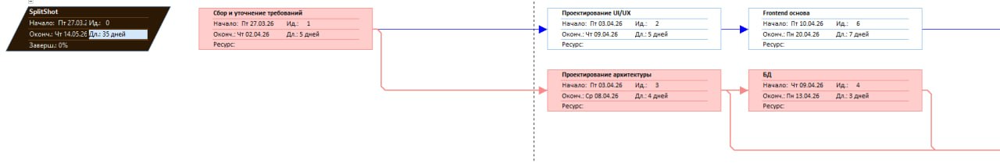
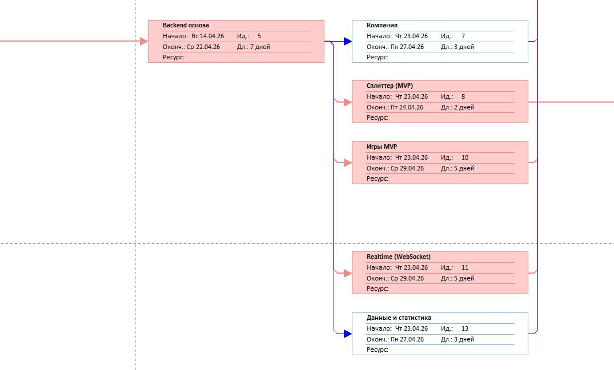
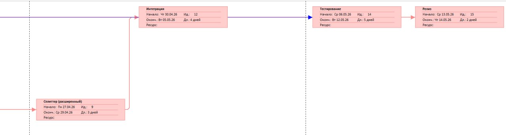

# PERT Diagram

## Описание
Диаграмма PERT отражает зависимости задач проекта и критический путь.  
Используется для оценки сроков и выявления узких мест.

---

## Диаграмма

---

## Исходный файл

Оригинал диаграммы в формате Microsoft Project:

[Открыть .mpp файл](SplitShot.mpp)

---

## Ключевые задачи (фрагмент)

| ID | Задача                      | Длительность | Зависимости |
|----|-----------------------------|--------------|-------------|
| T1 | Сбор и уточнение требований | 5 дней       | —           |
| T2 | Проектирование архитектуры  | 4 дня        | T1          |
| T3 | Разработка БД               | 3 дня        | T2          |
| T4 | Разработка backend          | 12 дней      | T3          |
| T5 | Разработка frontend         | 12 дней      | T2          |
| T6 | Интеграция                  | 4 дня        | T4, T5      |
| T7 | Тестирование                | 5 дней       | T6          |

---

## Критический путь

T1 → T2 → T3 → T4 → T5 → T6 → T7

Общая длительность: 35 дней

---

← [[Project Management]] | [[Home]]